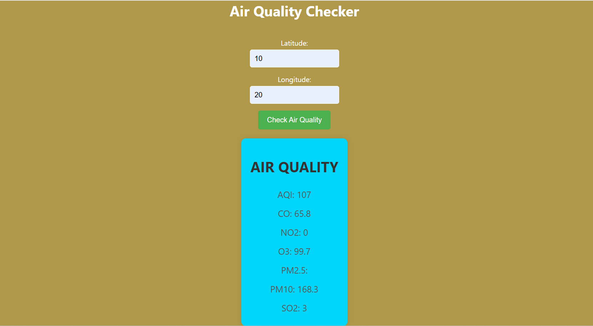

# Air Quality Checker

## Overview
The **Air Quality Checker** is a web-based application that allows users to check real-time air quality data for a specific location by entering **latitude** and **longitude** coordinates. The application fetches data from the **Air Quality API** and displays key pollution indicators.

## Features
- **User Input for Location:** Users enter **latitude** and **longitude** values.
- **Fetches Real-Time Data:** Requests air quality data from an external API.
- **Displays Air Quality Metrics:**
  - **AQI (Air Quality Index)**
  - **CO (Carbon Monoxide)**
  - **NO2 (Nitrogen Dioxide)**
  - **O3 (Ozone)**
  - **PM2.5 (Fine Particulate Matter)**
  - **PM10 (Coarse Particulate Matter)**
  - **SO2 (Sulfur Dioxide)**
- **Responsive UI:**
  - A clean and simple layout with color-coded sections.
  - A blue info box for displaying air quality data.
  - A green button to fetch results.

## API Information
To use this project, you need to obtain an API key from **RapidAPI's Air Quality API**. You can sign up and get access to the API using the following link:

[Get API Key & Access the Air Quality API](https://rapidapi.com/weatherbit/api/air-quality/playground/apiendpoint_bfab6dd3-e341-47ec-b762-5f17f1baf01f)

Once you have the API key, replace the placeholder key in the `index.js` file with your own.

## Output Screenshot
Below is an example of the output generated by the application:

